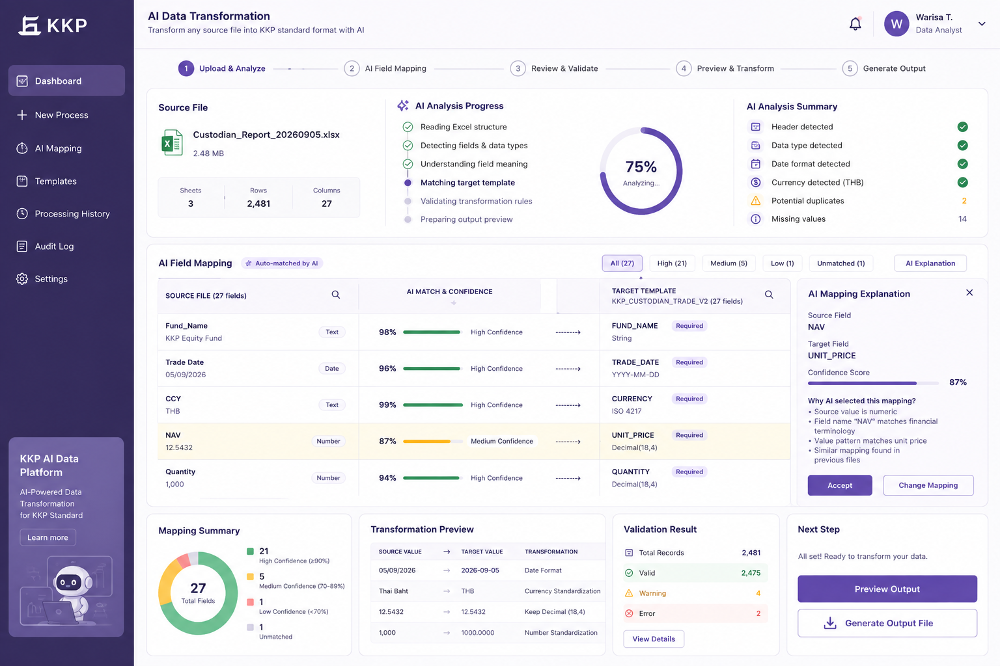
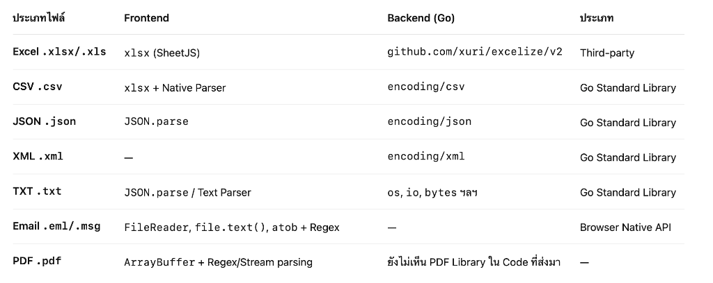

# KKP AI Data Transformation Platform

> **Enterprise Financial Data Transformation & Semantic Mapping System for Kiatnakin Phatra Financial Group (KKP)**



## Executive Summary

Source Excel/CSV files received from custodians, fund managers, and sub-agencies often use heterogeneous schemas and field names:
- **Source A**: `Fund_Name`, `Trade Date`, `CCY`, `NAV`, `Qty`, `Amount`
- **Source B**: `Fund`, `Transaction_Date`, `Currency`, `Net Asset Value`, `Quantity`, `Trade Amount`
- **Source C**: `Fund Name`, `Date`, `Currency Code`, `Unit Price`, `Units`, `Total Value`

The **KKP AI Data Transformation Platform** uses AI-powered semantic understanding to map, validate, and standardize incoming financial datasets into KKP's official standard format (`KKP_CUSTODIAN_TRADE_V2`).

### Core Philosophy
> *"Source files can be different, but the output must always follow the standardized target format."*
> **AI Suggests. Human Approves. System Transforms. Validation Protects.**

---

## Key Features

1. **Enterprise Banking UI**: Designed specifically for financial technology with KKP Deep Purple corporate branding (`#2e1d52`), rounded cards (`16px`), and high-trust status indicators.
2. **AI Field Mapping & Explanation Panel**: Displays confidence percentages (High ≥90%, Medium 70-89%, Low <70%) with a right-side drawer providing natural language AI reasoning.
3. **Interactive Human-in-the-loop**: Allows Data Analysts to accept mappings or override target field assignments with memory tracking.
4. **Before/After Transformation Preview**: Live transformation rule inspection (Date formatting to `YYYY-MM-DD`, Currency standardization to `THB`, Decimal precision to `18,4`).
5. **Excel Output Generator**: Generates real, downloadable standard `.xlsx` files using Golang's `excelize` library.
6. **Enterprise Audit Trail**: Immutable log recording user actions, timestamps, and target modifications for compliance.
7. **100% Free AI Engine**: Out-of-the-box zero-cost Mock AI Provider interface ready for immediate demo execution without external LLM API key dependencies.

---

## Tech Stack

### Frontend
- **Framework**: Next.js 15+ (App Router)
- **Language**: TypeScript
- **Styling**: Tailwind CSS v4 (KKP Banking Deep Purple Theme)
- **Icons**: Lucide React
- **Charts**: Recharts
- **State Management**: Zustand

### Backend
- **Language**: Golang 1.24+
- **REST Framework**: Go Fiber
- **Excel Library**: `github.com/xuri/excelize/v2`
- **AI Abstraction**: Plug-and-play `AIProvider` interface (`MockAIProvider`, `OpenAICompatibleProvider`)

### Infrastructure
- **Containerization**: Docker & Docker Compose
- **Database**: PostgreSQL 16

---

## File Parsing & Processing Architecture

ตารางและภาพรวม Library / Native API ที่ใช้จัดการและประมวลผลไฟล์แต่ละประเภททั้งฝั่ง Frontend และ Backend (Go):



| ประเภทไฟล์ | Frontend | Backend (Go) | ประเภท |
| :--- | :--- | :--- | :--- |
| **Excel .xlsx/.xls** | `xlsx (SheetJS)` | `github.com/xuri/excelize/v2` | Third-party |
| **CSV .csv** | `xlsx + Native Parser` | `encoding/csv` | Go Standard Library |
| **JSON .json** | `JSON.parse` | `encoding/json` | Go Standard Library |
| **XML .xml** | — | `encoding/xml` | Go Standard Library |
| **TXT .txt** | `JSON.parse / Text Parser` | `os, io, bytes ฯลฯ` | Go Standard Library |
| **Email .eml/.msg** | `FileReader, file.text(), atob + Regex` | — | Browser Native API |
| **PDF .pdf** | `ArrayBuffer + Regex/Stream parsing` | ยังไม่เห็น PDF Library ใน Code ที่ส่งมา | — |

---

## Local Quick Start

### 1. Run Backend (Golang)
```bash
cd backend
go run cmd/server/main.go
# Server starts on http://localhost:8080
```

### 2. Run Frontend (Next.js)
```bash
cd frontend
npm install
npm run dev
# Frontend starts on http://localhost:3000
```

### 3. Run with Docker Compose
```bash
docker-compose up --build
```

---

## Demo Workflow Steps

1. Open `http://localhost:3000` (Defaults to **New Process** step 2 matching `uiINIT.png`).
2. Observe the top **Source File** card, **AI Analysis Progress** gauge (75%), and **AI Analysis Summary**.
3. Inspect the **AI Field Mapping Table**:
   - `Fund_Name` → `FUND_NAME` (98% High Confidence)
   - `Trade Date` → `TRADE_DATE` (96% High Confidence)
   - `CCY` → `CURRENCY` (99% High Confidence)
   - `NAV` → `UNIT_PRICE` (87% Medium Confidence)
   - `Quantity` → `QUANTITY` (94% High Confidence)
4. Click on the `NAV` row to view the **AI Mapping Explanation Panel** on the right drawer.
5. Click **Accept** or **Change Mapping** to modify target parameters.
6. Scroll to the bottom grid to view **Mapping Summary** (Donut Chart), **Transformation Preview**, **Validation Result** (2,475 Valid, 4 Warning, 2 Error), and click **Generate Output File** to download the standard `.xlsx` Excel file.
